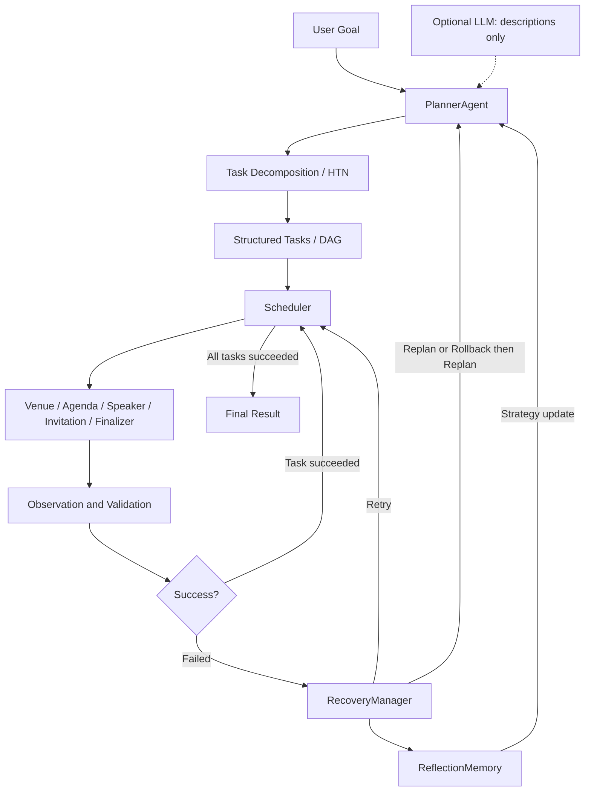
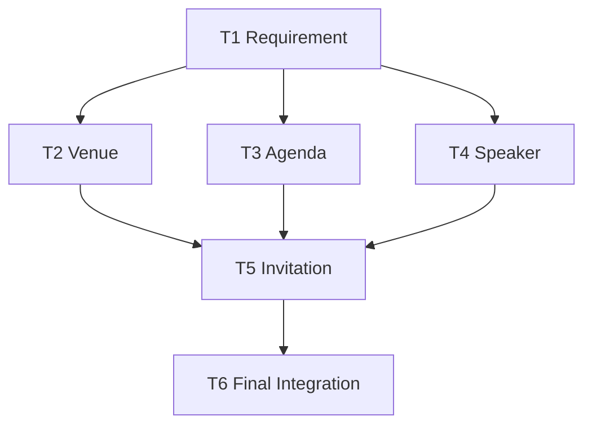
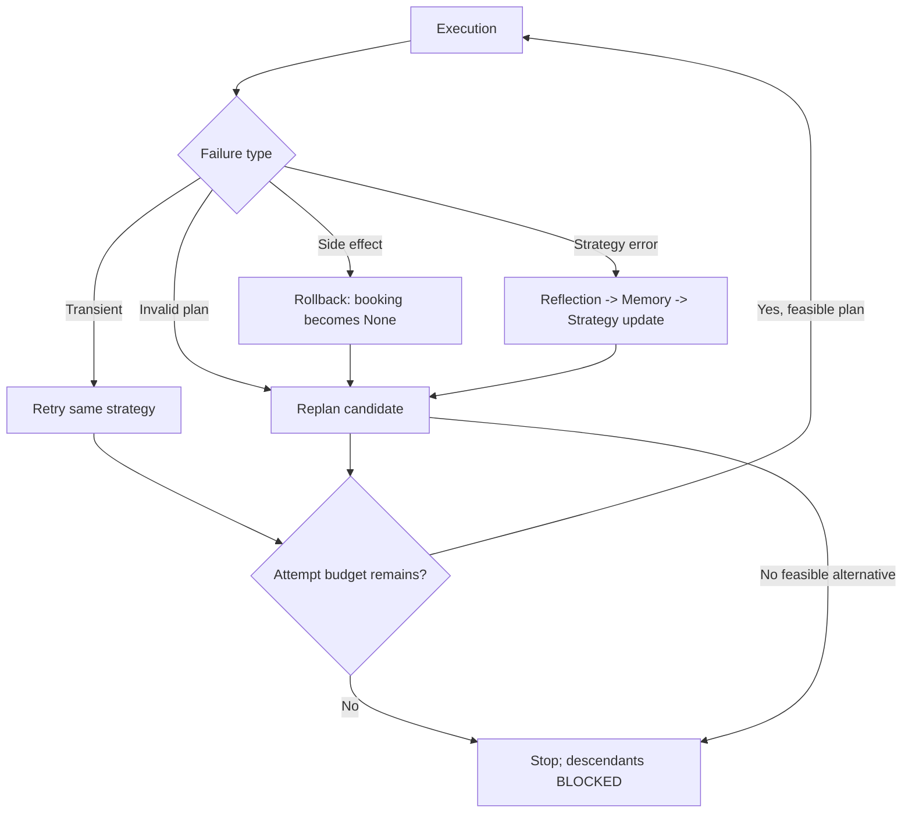

# Task 04 — Task Decomposition and Planning

第一次阅读代码的同学，请先看 [STUDENT_LEARNING_GUIDE.md](STUDENT_LEARNING_GUIDE.md)。它提供按 T2 Venue Planning 追踪代码的阅读顺序、三个核心学习点、故障模式对比和课后练习。

## Project Overview

为 **50 名学生组织一天的 AI Agent Seminar**，演示 Goal → Planning → Task Decomposition → DAG → Execution → Observation → Recovery → Final Result。适用于 20 分钟大学 Seminar，核心只用 Python 标准库。

默认 `MOCK_MODE=True`、`LLM_MODE=False`：无需 API Key、网络、LLM 或外部预订服务。各 Agent 是规则驱动的职责模块，不是多个模型互相聊天。可选 LLM 只增强任务描述；依赖、状态、成功标准和恢复决策始终由代码控制。

固定日期 **2026-11-20**；人数 **50**；总预算 **CNY 8000**；场地上限 **5000**；讲者费用 **1500**；餐饮 **1000**。可在 `config.py` 调整，预算分配会校验。

## How to Run

使用 Python 3.11+：

```powershell
cd E:\Demo\multi_agent_task_demo
python main.py
python main.py --mode mock --failure replan
```

本机系统 `python` 原来是 3.10.11，仍兼容本 Demo。本次另在 `E:\Demo\.python311` 准备了工作区独立的 **Python 3.11.9** 并完成测试，没有修改系统 PATH。直接使用它：

```powershell
..\.python311\python.exe main.py --mode mock --failure replan
```

也可运行 `.\run_demo.cmd --mode mock --failure replan`，入口优先选择该工作区运行时，在 PowerShell 和命令提示符中都可用。若希望本次终端中的 `python` 指向 3.11，可执行 `$env:Path = "E:\Demo\.python311;" + $env:Path`；只影响当前终端。

没有第三方依赖，不需要联网安装。`requirements.txt` 只有说明；完整 Python 环境可用 `python -m pip install --no-index -r requirements.txt` 检查。工作区嵌入式运行时未附带 pip，运行和测试均不需要它。

## Demo Modes

```powershell
python main.py --mode mock --failure none
python main.py --mode mock --failure retry
python main.py --mode mock --failure replan
python main.py --mode mock --failure rollback
python main.py --mode mock --failure reflexion
python main.py --mode mock --failure replan --show-graph
```

| 模式 | 首次故障 | 恢复路径 | T2 尝试次数 | 最终场地 / 总费用 |
|---|---|---|---:|---|
| none | 无 | 正常完成 | 1 | Venue A / 7000 |
| retry | 查询超时 | RETRY，相同候选和约束再执行 | 2 | Venue A / 7000 |
| replan | A 不可用 | REPLAN → B | 2 | Venue B / 7300 |
| rollback | 已预订，但确认房间只有 30 座 | ROLLBACK → REPLAN → B | 2 | Venue B / 7300 |
| reflexion | 漏掉预算筛选，A 价格变为 6000 | REFLEXION → 规则更新 → REPLAN → B | 2 | Venue B / 7300 |

基础数据 `data/venues.json` 与课堂案例一致：

| 场地 | 座位 | 价格 | 可用性 | 约束判断 |
|---|---:|---:|---|---|
| Venue A | 60 | 4500 | false | capacity PASS、budget PASS、availability FAIL |
| Venue B | 55 | 4800 | true | 全部 PASS |
| Venue C | 40 | 3000 | true | capacity FAIL |

`replan` 使用基础可用性；其他模式把 A 覆盖为 available=true，以独立演示无故障、超时、错误预订或预算遗漏；reflexion 还把 A 的价格覆盖为 6000。`[SCENARIO]` 会显示覆盖内容。每次运行重新加载数据，业务结果和事件顺序可重复，真实时间戳自然不同。

默认故障由 `config.py` 的 `FAILURE_MODE` 决定，为 `venue_unavailable`。别名 `transient_error`、`venue_unavailable`、`bad_booking` 对应 retry、replan、rollback。`--show-graph` 额外打印 Mermaid 源码并继续执行。

## Task Granularity：可运行的粒度对比

```powershell
python main.py --granularity coarse
python main.py --granularity normal
python main.py --granularity fine
```

**作用范围**：这是主流程前的独立场地微实验，使用相同的 `Scheduler` 和 `DependencyGraph`。完整 Seminar DAG 始终保留六个任务。每次都执行三种粒度以展示对比表，参数选择重点展示的任务链和讲解。

- **Coarse**：Handle Venue，一个节点负责全部操作。只有一个任务产物边界，不易独立监督中间结果，失败定位与恢复范围更粗。
- **Normal**：Search Venue → Validate Constraints → Confirm Venue，三个节点的输入输出可分别验证。
- **Fine**：Open Source → Query → Read Result → Capacity → Budget → Availability → Confirm → Save Result，八个节点。

三者完成相同的八个底层动作，都成功确认 B，使用隔离预订状态、不注入故障，不影响主流程。依赖任务的 output 会实际传给下一个节点。当前实测：

| Level | Number of Tasks | Scheduler Steps | Execution Events | Dependency Handoffs |
|---|---:|---:|---:|---:|
| coarse | 1 | 1 | 21 | 0 |
| normal | 3 | 3 | 31 | 2 |
| fine | 8 | 8 | 56 | 7 |

统计来自真实执行：Scheduler Steps 是调度轮数；Execution Events 包括状态、调度、动作、观察和预订事件；Handoffs 是依赖边上的结果传递次数。这些计数说明控制和通信边界增加，**不代表实测网络通信量或性能耗时**。底层动作与历史保存在 `granularity_report.json`，不是写死的演示数字。

粒度选择原则：每个任务有清晰产物、负责人、可验证的成功标准与独立恢复边界。过粗会隐藏这些边界；过细增加调度与上下文传递成本。主流程采用六个业务任务，场地 primitive 留在 T2 内部。

## Concept Mapping

| Demo Component | Course Concept | 实际作用 |
|---|---|---|
| PlannerAgent | Planner–Executor | 全局规划：生成六个任务和依赖，恢复时修改候选 |
| task_tree / primitives | HTN | 表达层次并递归展开；生成真正执行的场地 primitive |
| DependencyGraph | DAG | 保存和验证依赖、检测环及缺失节点 |
| Scheduler | Task Coordination | 依赖就绪、分派执行、管理状态和调度轮次 |
| Venue execution loop | ReAct | 局部/在线决策：简短决策摘要 → 工具动作 → 观察反馈 |
| Retry handler | Retry | 同一策略重新执行，默认最多三次尝试（包含首次） |
| MockVenueService.cancel | Rollback | 清空当前 booking，保留 cancelled 审计记录 |
| PlannerAgent.replan | Replan | 选择满足约束的替代场地，重新执行验证 |
| ReflectionMemory | Reflexion | 保存失败经验和结构化规则，改变下一次策略 |
| BasePlanner / MockPlanner / LLMPlanner | 可选内容增强 | 生成展示描述，不接管执行控制 |

### HTN

HTN answers: **“How should a complex task be recursively decomposed?”**

```text
Organize Seminar                         Compound
  Requirement Analysis                   T1
  Venue Planning                         T2 / Compound
    Search Venue                         Primitive
    Check Capacity                       Primitive
    Check Availability                   Primitive
    Check Budget                         Primitive
    Confirm Venue                        Primitive
  Agenda Design                          T3
  Speaker Planning                       T4
  Invitation Preparation                 T5
  Final Integration                      T6
```

`primitives()` 递归展开场地子树，结果写入 `T2.input.primitives`，`VenueExecutor` 按列表真正执行。这里是固定方法的教学分解，未实现完整学术 HTN 搜索。**树表达组成关系，DAG 表达执行依赖。**

### Planner 与 ReAct

Planner 做 **Global Planning**：生成任务与依赖、决定初始候选、更新全局计划。VenueExecutor 的 ReAct 风格循环展示 **Local / Online Decision Making**：执行动作、读取观察、判断约束，失败时把类型化观察交给恢复管理器。候选切换统一由 Planner 负责。

`[REASON]` 只输出手写的 Decision Summary，不是模型隐藏 chain-of-thought。默认模式没有模型内部推理。

### Dependency 与 Task lifecycle

T1 先执行；T2/T3/T4 随后同时 READY，通过 `asyncio.gather` 协作式并发执行。工具用 `await asyncio.sleep(0)` 模拟异步 I/O 的让出执行权，没有随机延迟；这是单线程并发，不是 CPU 多核并行。

T5 直接依赖 T2/T3/T4；T6 直接依赖 T5，间接依赖全部上游。Finalizer 还独立验证 T1–T5 状态，避免绕过 Scheduler 时错误整合。

```text
PENDING → BLOCKED → READY → RUNNING → SUCCESS
    └────────────→ READY       └──→ FAILED → BLOCKED → READY
```

依赖未全部 SUCCESS，任务保持 BLOCKED；全部成功才能 READY；开始 RUNNING 前再次检查。每一轮并发任务都返回后统一处理恢复。成功的 T3/T4 不会因为 T2 的失败而重复执行。

## Failure Recovery

| Failure Type | Decision | 原因 |
|---|---|---|
| TRANSIENT_ERROR | RETRY | 临时超时，原策略仍有效 |
| SIDE_EFFECT_ERROR | ROLLBACK，然后 REPLAN | 已经改变预订状态，需要先撤销 |
| INVALID_PLAN | REPLAN | 原候选或假设不成立 |
| STRATEGY_ERROR | REFLEXION，然后 REPLAN | 约束遗漏，需要修改未来策略 |

**为什么不能所有错误都 Retry？** 固定日期 A 不可用时，重复相同请求不能修复资源约束。需要选择 B，重新验证容量、预算与可用性。

**Rollback 改了什么？** 创建 A 时 `state.booking` 指向预订；发现只有 30 座后，取消把它置为 `None`。旧记录保留在 `state.bookings`，标记 cancelled。B 确认后才成为新的当前 booking。即使尝试次数耗尽，也先撤销错误预订。这是本地补偿操作，不是数据库事务。

**Reflexion 怎么生效？** 初次 `check_budget=False`，独立验证器在预订前拒绝 6000 元候选。ReflectionMemory 记录 reflection、lesson 与 `rule=check_budget`。Planner 读取记忆，更新 `check_budget=True`，日志显示 MEMORY UPDATE 和 STRATEGY UPDATE，再规划到 B。记忆作用域为当前运行后续尝试，导出到 JSON；每条新命令重置记忆以便重复教学，没有长期记忆或模型训练。

**哪里容易失败？** 查询边界可能超时，计划假设可能与资源可用性不一致，有副作用的服务可能确认错误资源，Planner 可能漏约束，多任务合并可能使用过时结果。分别需要 Retry、Replan、Rollback、Reflexion 和最终一致性验证。

本例故障发生在 T2 成功之前，T5/T6 尚未执行，恢复期间保持 BLOCKED，之后读取新的 Venue B。未实现“下游已经完成后因外部变化而失效”的通用机制。无可行替代方案、达到次数上限或不支持的错误会停止，下游不会假装成功。未知故障不无限重试。

## Mock vs LLM Mode

```powershell
python main.py --mode mock
python main.py --mode llm
```

| 项目 | Mock | LLM |
|---|---|---|
| 默认 | 是 | 否 |
| 任务展示描述 | 本地固定文本 | API 生成，经验证后接受 |
| 场地、议程、讲者、邀请 | 本地规则和数据 | 同样使用本地规则和数据 |
| 状态、DAG、依赖、恢复、成功标准 | 代码控制 | 代码控制 |
| 网络 | 无 | 仅一次可选描述请求 |
| 无密钥/无模型名/出错 | 正常运行 | 提示并回退 Mock，继续完整演示 |

适配器使用 OpenAI Responses API。设置环境变量 `OPENAI_API_KEY` 和 `OPENAI_MODEL`，模型名使用你账户可访问且支持 Responses Structured Outputs 的模型。密钥只从环境变量读取，不写入源码、日志或 JSON，无需发给任何人。项目不自动加载 `.env` 文件。

`llm/base.py` 定义内容接口；MockPlanner 返回本地描述；LLMPlanner 只接收 Goal 与六个描述字符串，不能访问 Task、服务对象或运行状态。它只请求 JSON 描述，不提供工具调用。返回值必须恰好包含 T1–T6，每条不超过 240 字符且不含控制字符；多余字段、拒绝、截断和非法 JSON 都回退。

合格文本仅写入 `Task.input.display_description` 并在 `[DESCRIPTION]` 中展示，原始 goal 与执行规则不变。网络 I/O timeout 为 5 秒，整个可选请求等待上限 6 秒，无 API 重试；后台线程不阻塞进程退出，迟到响应不修改任务。请求使用 `store=false`。接口格式参考 [OpenAI 官方 Structured Outputs 文档](https://developers.openai.com/api/docs/guides/structured-outputs)。

LLM 可能生成不准确的描述，因此只作为可选对比；Mock 是课堂主线。当前没有 API Key，未调用真实收费 API；已验证无密钥回退，并用替代 transport 测试成功、超时、拒绝、错误格式和规则隔离。

## Architecture — Overall Architecture



### Task DAG



运行时 `task_dag.mmd` 来自实际 dependencies，与这里的图一致。

### Failure Recovery Diagram



恢复图表达概念路径；代码先检查剩余次数再规划，但错误预订始终先撤销。

### 与 graph-based orchestration 的关系

RunState 对应共享状态，Executor 对应执行节点，dependencies 对应依赖边，RecoveryManager 对应条件路由，Scheduler 管理就绪和执行。这与 StateGraph 的状态、节点、边在概念上对应；本项目不依赖 LangGraph，也没有重建它的运行时。

## What to Observe During Demo

1. **PLANNER**：六个任务；initial_tasks.json 中的 goal、input、output、dependencies、success_criteria、recovery_policy、assigned_executor。
2. **HTN / GRANULARITY**：树的组成关系与任务边界；三种粒度做相同工作，但调度成本不同。
3. **SCHEDULER**：T2/T3/T4 同时 READY；T5/T6 BLOCKED。
4. **REASON / ACT / OBSERVE**：简短决策摘要、动作与观察；容量和预算显示具体数值。
5. **FAILURE DETECTED / RECOVERY DECISION**：故障类型决定恢复动作。
6. **PLAN UPDATE**：A → B；T3/T4 不重做；新场地确认后 T5 才开始。
7. **FINAL RESULT**：B 场地费用 4800，总费用 7300；邀请使用 B；仅一个 active booking。
8. **日志**：execution_log.txt 保存真实 UTC 时间戳、任务生命周期和恢复动作；events.json 可逐字段查看。

## 文件结构与核心职责

```text
multi_agent_task_demo/
  main.py                       CLI、内容增强、微实验、组装与导出
  config.py                     模式、预算和尝试上限
  run_demo.cmd                  优先使用工作区 Python 3.11 的 Windows 入口
  requirements.txt              纯标准库，无第三方依赖
  README.md                     概念映射、架构、运行与验证说明
  STUDENT_LEARNING_GUIDE.md     面向同学的代码阅读路径与练习
  PRESENTATION_GUIDE.md         20 分钟课堂流程与讲者提示
  .gitignore                    排除 Python 缓存、虚拟环境和 .env
  models/
    task.py                     Task / Status / 类型化 TaskFailure
    state.py                    RunState、当前 booking、事件与状态迁移
  agents/
    planner.py                  任务生成、HTN 递归展开、Replan
    venue_executor.py           ReAct 风格场地验证与预订
    agenda_executor.py          全天议程
    speaker_executor.py         模拟讲者与主题分配
    invitation_executor.py      根据成功上游结果生成邀请草稿
    finalizer.py                需求校验、最终整合和一致性验证
  orchestration/
    scheduler.py                依赖驱动并发调度、轮数统计
    dependency_graph.py         DAG 校验、依赖查询、下游遍历、图导出
    recovery.py                 按失败类型选择恢复动作
    reflection.py               ReflectionMemory，保存可执行规则
    granularity.py              1/3/8 节点微实验与实测统计
  llm/
    base.py                     BasePlanner 内容接口
    mock.py                     MockPlanner 离线描述
    optional_llm.py             LLMPlanner 请求、验证、超时与回退
  tools/
    mock_venue_service.py       故障注入、查询、创建/取消预订
  data/
    venues.json                 基础场地数据
  tests/
    test_demo.py                核心流程与恢复回归测试
    test_enhancements.py        粒度、日志、邀请与 LLM 回退测试
  outputs/
    execution_log.txt           含完整事件字段的可读日志
    events.json                同一批事件的结构化 JSON
    initial_tasks.json          执行前任务快照
    task_tree.json             HTN 层次树
    task_dag.mmd               实际依赖导出的 Mermaid
    granularity_report.json    三种粒度的任务、事件、结果与统计
    run_state.json             任务历史、当前/历史预订、记忆、计划更新
    final_plan.json            成功时生成的完整活动方案
    cases/<mode>/             各故障模式实测产物
    granularity/<level>/       各粒度命令实测产物
    llm-fallback/              无密钥 LLM 回退实测产物
```

各包还包含仅标识包的 `__init__.py`。数据与默认输出按源文件位置定位，从其他目录也能启动。

每条事件包括 `timestamp / task_id / task_name / old_status / new_status / executor / event / failure_type / recovery_action`，不适用字段为 null（文本显示 `-`）；全局事件没有 task_id。终端只显示简洁标签。时间戳使用 UTC，sequence 表示事件顺序。

每次运行覆盖指定目录中的 Demo 产物，并先清除旧 final_plan.json，防止失败后误读上次结果。保留单次演示：

```powershell
python main.py --mode mock --failure rollback --output-dir outputs/my-rollback
```

## 验证与课堂顺序

```powershell
python -m unittest discover -s tests -v
# 使用工作区 Python 3.11：
..\.python311\python.exe -m unittest discover -s tests -v
```

32 项测试覆盖依赖阻塞/释放、协作式并发、五种故障模式、尝试上限、无替代场地、booking 清空、反思规则消费、最终整合、DAG 合法性、粒度计数、日志字段，以及可选 LLM 的成功/缺密钥/超时/拒绝/非法响应与规则隔离。没有测试需要真实 API。

推荐顺序：**replan 主线 → retry 对比 → rollback 副作用 → reflexion 日志片段 → granularity 表格 → 可选 llm 回退**。时间分配和逐步讲述见 [PRESENTATION_GUIDE.md](PRESENTATION_GUIDE.md)。现场只需终端与编辑器；Mermaid 可在支持它的 Markdown 预览中查看。
